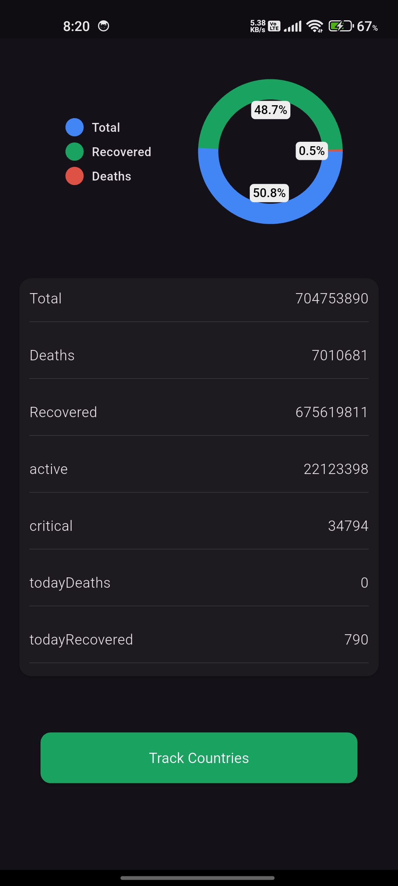
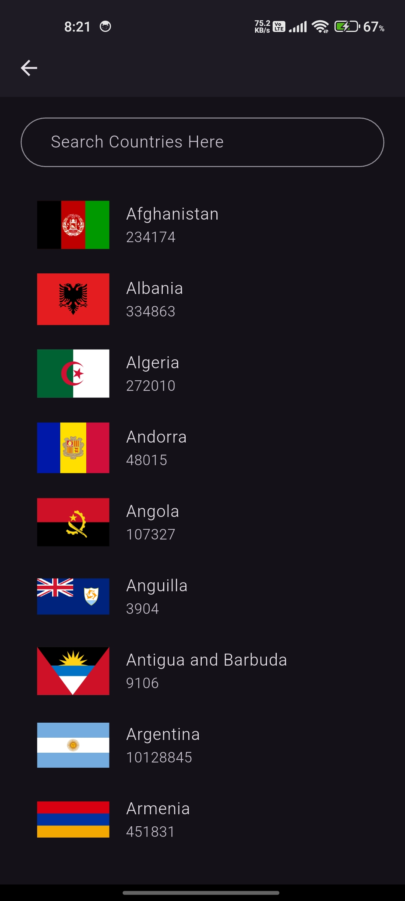
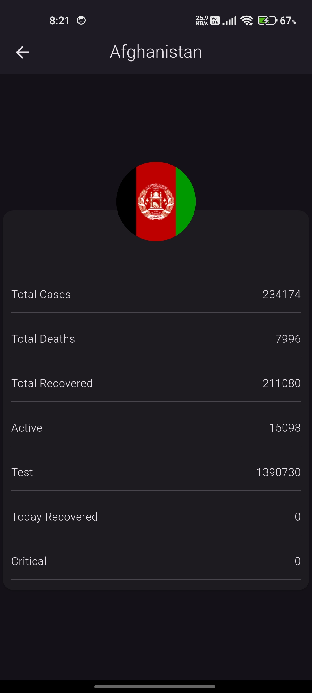

🦠 COVID-19 Tracker App

A modern Flutter application to track COVID-19 statistics worldwide. This project fetches live data from an API and displays global stats, country-wise details, and individual breakdowns. It’s designed for beginners to practice API integration, model classes, navigation, and clean UI in Flutter.

---

📱 Features

Splash Screen with rotating germ animation and app title

World Stats Page showing total cases, recoveries, and deaths

Countries List with search functionality

Details Page for each country with all stats

API integration for live COVID-19 data

Clean & responsive UI

Beginner-friendly code structure

---

📸 Screenshots

 

    
    
    
    
 

---

📌 Notes

This project is created for learning and practice purposes.

Focuses on API calls, JSON parsing, and navigation.

Code is written manually for better understanding.

🧑‍💻 Author

Sameer Asghar
GitHub Profile
